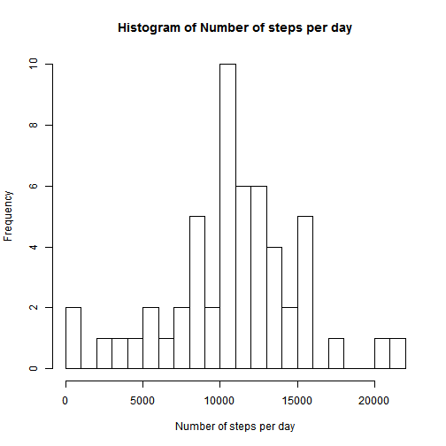
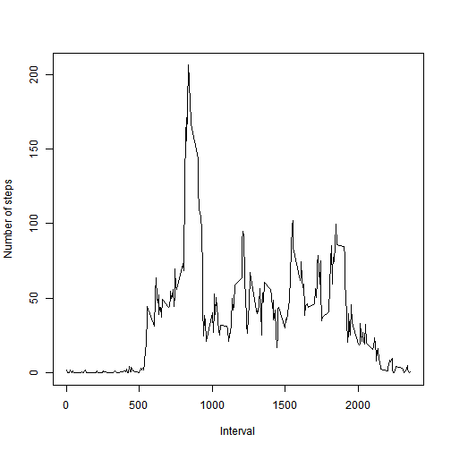
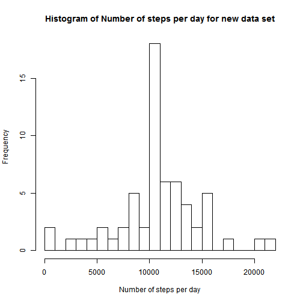
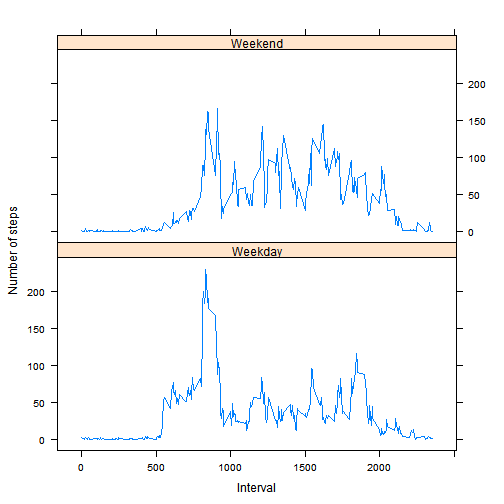

### 1.Loading and preprocessing the data

1.1 First step is step directory


```r
setwd("C:/Users/User/Desktop/R/RR/p1/RepData_PeerAssessment1")
```

1.2 Second step to download file if file is zip or file is not available. 


```r
   activity <- read.csv( "activity.csv")
```

### 2. What is mean total number of steps taken per day?


2.1 Converting date format for proper format

```r
activity$date <- as.Date(activity$date, "%Y-%m-%d")
range(activity$date)
```

```
## [1] "2012-10-01" "2012-11-30"
```

There are 61 date, which is right number of data because range of dates from 1 october to 30 Nov.  

2.2 aggreagting data for date.


```r
NumberOfStepsPerDay<-setNames(aggregate(steps~as.Date(date),
                                        activity,
                                        sum,
                                        na.rm = TRUE),
                                        c("date","steps"))
```


2.3 Histrogram Plot for steps per day create eariler.


```r
hist(NumberOfStepsPerDay$steps, breaks=20,
     main = paste("Histogram of Number of steps per day"), 
     xlab = paste("Number of steps per day"))
```

 

2.4  calcuating mean and medium total steps per day

```r
print("Average Number of steps per day")
```

```
## [1] "Average Number of steps per day"
```

```r
mean(NumberOfStepsPerDay$steps, na.rm= T )
```

```
## [1] 10766
```


```r
print("Median Number of steps per day")
```

```
## [1] "Median Number of steps per day"
```

```r
median(NumberOfStepsPerDay$steps, na.rm= T )
```

```
## [1] 10765
```

### 3. What is the average daily activity pattern?

trying to find range for interval

```r
range(activity$interval)
```

```
## [1]    0 2355
```

Aggregating steps per interval


```r
NumberOfStepsPerInterval<-aggregate(activity$steps,
                               FUN = mean,
                               by = list(
                                   activity$interval),
                               na.rm = TRUE)     
colnames(NumberOfStepsPerInterval)<- c("interval", "steps")
```


3.1 Make a time series plot (i.e. type = "l") of the 5-minute interval (x-axis) and the average number of steps taken, averaged across all days (y-axis)


```r
plot(NumberOfStepsPerInterval$interval, 
     NumberOfStepsPerInterval$steps,
     type = "l",
     xlab="Interval", 
     ylab="Number of steps")
```

 

3.2 Which 5-minute interval, on average across all the days in the dataset, contains the maximum number of steps?


```r
print("Interal where there are maximum number of steps ")
```

```
## [1] "Interal where there are maximum number of steps "
```

```r
NumberOfStepsPerInterval$interval[which.max(NumberOfStepsPerInterval$steps)]
```

```
## [1] 835
```

### 4. Imputing missing values


4.1 Calculate and report the total number of missing values in the dataset
calcuating missing alues in activity data set

```r
nrow(activity) - sum(complete.cases(activity))
```

```
## [1] 2304
```

4.2 Devise a strategy for filling in all of the missing values in the dataset.

```r
summary(activity)
```

```
##      steps            date               interval   
##  Min.   :  0.0   Min.   :2012-10-01   Min.   :   0  
##  1st Qu.:  0.0   1st Qu.:2012-10-16   1st Qu.: 589  
##  Median :  0.0   Median :2012-10-31   Median :1178  
##  Mean   : 37.4   Mean   :2012-10-31   Mean   :1178  
##  3rd Qu.: 12.0   3rd Qu.:2012-11-15   3rd Qu.:1766  
##  Max.   :806.0   Max.   :2012-11-30   Max.   :2355  
##  NA's   :2304
```


As we can see there are no NA value's in date or interval. However, there are 
NA value's in steps. Therefore, number of missing value calculated by 4.1 and 4.2 is same.

Here we are going to substitute NA of steps value with average value steps corresponds to same interval and create new data set


```r
ValueNA<-which(is.na(activity$steps)==TRUE)
length(ValueNA)
```

```
## [1] 2304
```

4.3 Create a new dataset that is equal to the original dataset but with the missing data filled in. Here using mean value of 5 minute interval to replace it


```r
newActivity<-activity

z<-1
j<-nrow(newActivity)
for (z in 1:j){
    if(is.na(newActivity$steps[z])){
        valueOfInterval<- newActivity$interval[z]
        newActivity$steps[z]<-
            NumberOfStepsPerInterval$steps[which( NumberOfStepsPerInterval$interval == valueOfInterval)]
       
    }else{
        activity$steps[z]<-activity$steps[z]
    }
}
```

4.4 histogram of the total number of steps taken each day 


```r
NewNumberOfStepsPerDay<-aggregate(newActivity$steps,
                               FUN = sum,
                               by = list(newActivity$date),
                               na.rm = TRUE)     
colnames(NewNumberOfStepsPerDay)<- c("date", "steps")
summary(NewNumberOfStepsPerDay$steps)
```

```
##    Min. 1st Qu.  Median    Mean 3rd Qu.    Max. 
##      41    9820   10800   10800   12800   21200
```

```r
hist(NewNumberOfStepsPerDay$steps, breaks=20,
     main = paste("Histogram of Number of steps per day for new data set"), 
     xlab = paste("Number of steps per day"))
```

 

4.5 Calculate and report the mean total number of steps taken per day.


```r
print("Average Number of steps per day")
```

```
## [1] "Average Number of steps per day"
```

```r
mean(NewNumberOfStepsPerDay$steps, na.rm= T )
```

```
## [1] 10766
```

4.6 **Calculate and report the median total number of steps taken per day**

```r
print("Median Number of steps per day")
```

```
## [1] "Median Number of steps per day"
```

```r
median(NewNumberOfStepsPerDay$steps, na.rm= T )
```

```
## [1] 10766
```

Do these values differ from the estimates from the first part of the assignment? What is the impact of imputing missing data on the estimates of the total daily number of steps?

Therefore difference between mean for new and old data set

```r
print("Difference between mean of old and new data set")
```

```
## [1] "Difference between mean of old and new data set"
```

```r
mean(NewNumberOfStepsPerDay$steps, na.rm= T )-mean(NumberOfStepsPerDay$steps, na.rm= T )
```

```
## [1] 0
```

There is no difference in mean between old data set and new data set


```r
print("Difference between median of old and new data set")
```

```
## [1] "Difference between median of old and new data set"
```

```r
median(NewNumberOfStepsPerDay$steps, na.rm= T )-median(NumberOfStepsPerDay$steps, na.rm= T )
```

```
## [1] 1.189
```

There is difference id median in old and new data set.

As we can see that median of new data set increase due to fact that large number of data were missing value

### 5. Are there differences in activity patterns between weekdays and weekends?

5.1 Create a new factor variable in the dataset with two levels - "weekday" and "weekend" indicating whether a given date is a weekday or weekend day

creating factor indicating weekday or weekend

```r
newActivity$factor<-weekdays(newActivity$date)
```


```r
newActivity$week<-ifelse(newActivity$factor %in% c("Saturday", "Sunday"), "Weekend", "Weekday")
```

5.2 Make a panel plot containing a time series plot (i.e. type = "l") of the 5-minute interval (x-axis)


```r
library("plyr")
NewNewActivity <- ddply(newActivity, .(interval, week), summarise, steps=mean(steps))
library(lattice)
xyplot(steps ~ interval | week, data = NewNewActivity, layout = c(1, 2), type="l", xlab = "Interval", ylab = "Number of steps")
```

 
